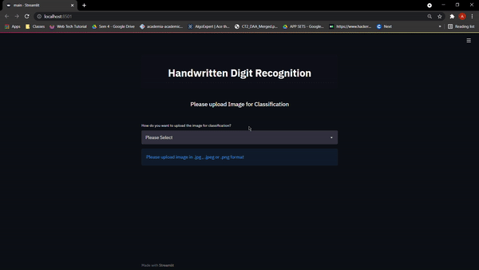

<h1 align='center'>Handwritten-digit-recognition</h1>
<h1 align='center' ></h1>
This Project aims to recognize handwritten digits. This model is implemented with Tensorflow and trained on MNIST dataset. I will be using a special type of deep neural network that is Convolutional Neural Networks.   
Basic steps to implement the project:  

1. Import the libraries and load the dataset  
2. Preprocess the data  
3. Create the model  
4. Train the model  
5. Evaluate the model  
6. Create GUI to predict digits  

## Guidelines for Usage

- Cloning the Repository: 

        git clone https://github.com/mishra1683/Handwritten-digit-recognition.git
- Setting up the Python Environment with the dependencies:

        pip install -r requirements.txt

- Running the Web App:

        streamlit run main.py
        
- Stopping the web app from the terminal:

        Ctrl+C
        
## Demonstration
   
